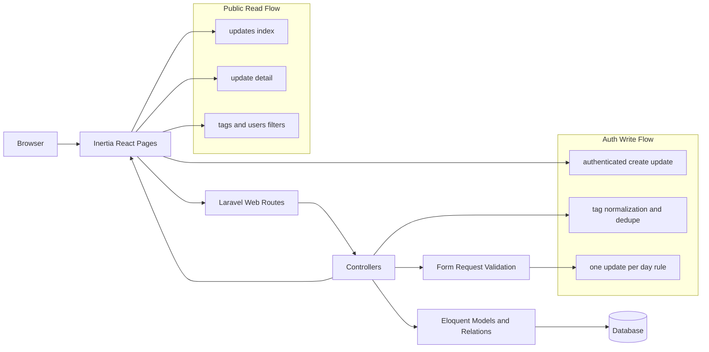

# Today I Have

A lightweight daily engineering update tracker built with Laravel 12, Inertia React, and Tailwind v4.

This project was built to demonstrate full-stack product delivery under realistic constraints: clean domain rules, polished UX, and reliable automated testing.

## Submission Highlights

- Homepage redirects to the updates feed (`/` -> `/updates`)
- Public updates timeline grouped by day
- Update detail page with author, date, and tags
- Tag pages to filter updates by topic
- User pages to filter updates by author
- Users directory with activity insights (`updates_count`, `last_update_on`, recent activity flag)
- Authenticated update posting flow
- Normalized tag parsing (trim/lowercase), de-duplication, and tag reuse
- Clear one-update-per-user-per-day rule enforced by validation + database + tests
- Responsive public navbar and shared public layout

## Why This Submission Is Competitive

- Product completeness: covers the full workflow from content creation to public discovery and filtering.
- Technical consistency: business rules are aligned across request validation, persistence constraints, and test assertions.
- Engineering discipline: PR-driven development, CI green checks, and focused feature/integration tests.
- UX quality: responsive navigation, coherent public pages, and intuitive filtering paths by user and tag.

## Stack

- Backend: Laravel 12, PHP 8.4+
- Frontend: Inertia.js v2 + React 19 + TypeScript
- Styling: Tailwind CSS v4
- Database: SQLite by default (easy local setup)
- Tests: Pest 4 (feature and integration coverage)

## Reviewer Quick Start (5 Minutes)

1. Install dependencies and prepare app:

```bash
composer install
npm install
cp .env.example .env
php artisan key:generate
touch database/database.sqlite
php artisan migrate --force
```

2. Run the app:

```bash
composer run dev
```

3. Open the app:

- Updates feed: `http://127.0.0.1:8000/updates`
- Users directory: `http://127.0.0.1:8000/users`
- Tags directory: `http://127.0.0.1:8000/tags`

4. Run tests:

```bash
php artisan test --compact
```

## Architecture Snapshot



## Product Behavior

### Public

- Anyone can browse updates, update detail pages, tags, and users.
- Navigation is available through the global public navbar.

### Authenticated

- Logged-in users can create updates.
- Tags can be passed as comma-separated values and are normalized before attach.

### Data Rules

- One update per user per day.
- Reusing the same title on different days is allowed.

## Tests & Quality

Run the full quality pipeline used in CI:

```bash
composer run test
```

Useful targeted commands:

```bash
php artisan test --compact --filter=UpdateControllerTest
php artisan test --compact --filter=UpdatePostingFlowTest
vendor/bin/pint --dirty --format agent
```

## Project Structure (Key Paths)

- Routes: `routes/web.php`
- Controllers: `app/Http/Controllers`
- Validation: `app/Http/Requests/StoreUpdateRequest.php`
- Inertia pages: `resources/js/pages`
- Shared layout/components: `resources/js/layouts`, `resources/js/components`
- Tests: `tests/Feature`

## Trade-offs and Next Iterations

- Current timeline loads all updates before grouping by day. For larger datasets, pagination or infinite scroll is the next step.
- Tag search and sorting can improve discoverability as update volume grows.
- Browser E2E tests are not installed yet; current confidence relies on feature/integration test coverage.

## Demo Script (for Evaluators)

Use this 2-minute walkthrough to evaluate product value quickly:

1. Open updates feed and verify homepage redirect behavior.
2. Navigate to a user page and confirm filtered updates grouped by day.
3. Navigate to a tag page and confirm cross-user filtering by topic.
4. Sign in, create a new update with comma-separated tags, and verify it appears in:
	- updates feed
	- update detail page
	- tag detail page
5. Attempt a second update on the same day for the same user and confirm validation blocks it.
